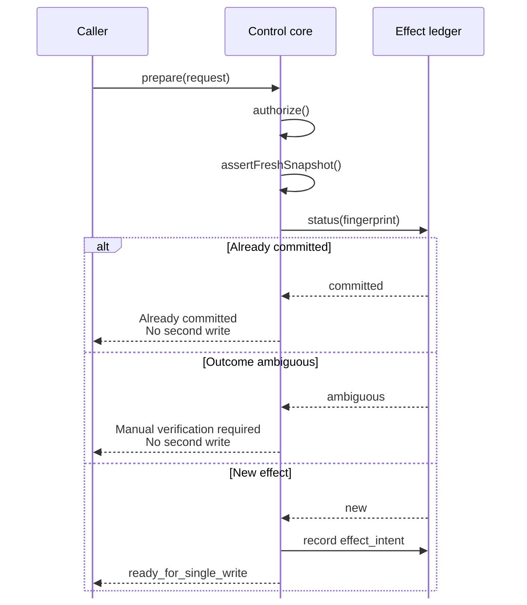

# Attended Browser Bridge

A browser write should have permission, a fresh view of the page, and a record of what happened. This JavaScript core checks those conditions and blocks replay when an earlier write is committed or uncertain.

**A timeout is not permission to double-click your problems.**

This is a **public sample from my private browser automation work**. It isolates the write-control logic for review; I can build and adapt the surrounding browser workflows and integrations for a project's requirements. The browser driver and session plumbing stay outside this repo.

## Write / effect sequence

**Prepare and reserve the effect.**

**Write once, then verify the outcome.**

```mermaid
---
config:
  sequence:
    actorMargin: 50
    messageMargin: 28
    mirrorActors: false
    wrap: false
---
sequenceDiagram
    accTitle: Write once and verify the browser effect
    accDescr: Sequence for write once and verify the browser effect.
    participant Caller
    participant Core as Control core
    participant Ledger as Effect ledger
    participant Driver as Browser driver
    Note over Driver: External integration
    Note over Caller,Core: Start only after prepare returns<br/>ready_for_single_write
    Caller->>Driver: One external write
    Driver-->>Caller: Fresh readback
    alt Effect verified
        Caller->>Core: commit(fingerprint)
        Core->>Ledger: record effect_commit
        Core-->>Caller: committed
    else Outcome uncertain
        Note over Caller,Ledger: Stop - intent remains ambiguous
    end
```

## The write contract

A write can reach the external driver only after the public core proves two preconditions: the grant covers the origin/action and the observed snapshot is fresh.

- `authorize()` checks grant expiry, origin, and action.
- `assertFreshSnapshot()` checks origin, revision, age, and digest.
- `BrowserBridge.prepare()` fingerprints the logical effect and asks the ledger for its current state.
- A **new** effect records `effect_intent` before returning `ready_for_single_write`.
- The external driver may attempt that write once, then read back what happened.
- Verified readback can be committed. Unverified readback leaves the intent **ambiguous**, so replay stays blocked.

| Ledger state on replay | Core response | Write again? |
|---|---|---:|
| `new` | record intent → `ready_for_single_write` | once |
| `ambiguous` | `manual_verification_required` | no |
| `committed` | `already_committed` | no |

## Inspect the implementation

| Question | Implementation | Proof |
|---|---|---|
| Is this origin/action authorized now? | [`src/policy.js`](src/policy.js) | [`test/policy.test.js`](test/policy.test.js), [`test/bridge.test.js`](test/bridge.test.js) |
| Is the observation still safe to act on? | [`src/snapshot.js`](src/snapshot.js) | [`test/snapshot.test.js`](test/snapshot.test.js), [`test/bridge.test.js`](test/bridge.test.js) |
| How is one logical effect identified? | [`src/canonical.js`](src/canonical.js) | [`test/bridge.test.js`](test/bridge.test.js) |
| How do `new → ambiguous → committed` states work? | [`src/ledger.js`](src/ledger.js) | [`test/ledger.test.js`](test/ledger.test.js) |
| Where are the gates composed? | [`src/bridge.js`](src/bridge.js) | [`test/bridge.test.js`](test/bridge.test.js) |

More edge-case detail: [write-state table](docs/write-state-table.md), [invariants](docs/invariants.md), [failure modes](docs/failure-modes.md), and [timeout walkthrough](docs/walkthrough.md). Verification commands and expected checks are in [docs/verification.md](docs/verification.md).

## Scope and provenance

This public repository demonstrates the control-plane logic only. It does **not** contain a Chrome/browser transport, cookies or session access, local bridge secrets, Kaggle-specific controls, or target-site automation. It does not perform real browser actions by itself.

See [`PROVENANCE.md`](PROVENANCE.md) and [`SECURITY.md`](SECURITY.md) for the boundary in detail.
