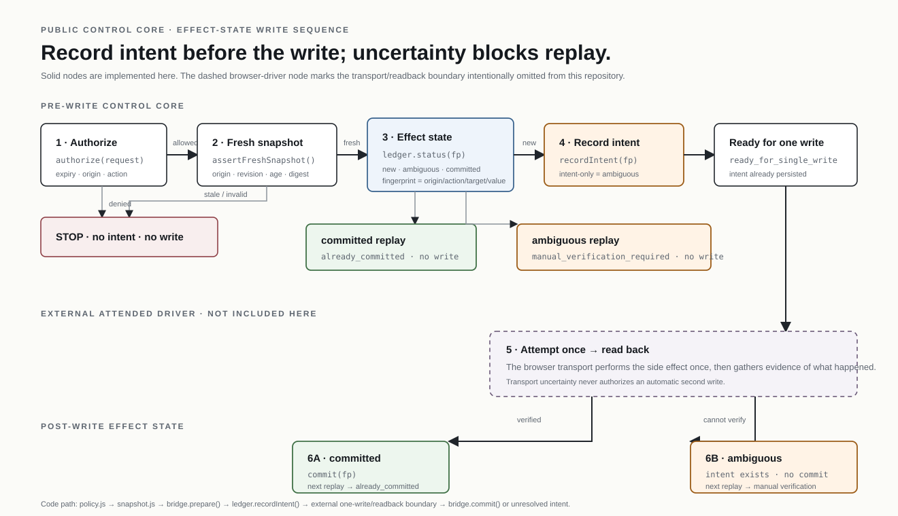

# Attended Browser Bridge

**Browser automation, but with trust issues. Healthy trust issues.**

This is the public control-core slice of my private Browser Bridge work.

The private project can operate an attended browser. This repo focuses on the part I care about most: deciding whether a write should happen at all, and what to do when the result is uncertain.

## The rule that ruins many “smart” automations

**If the write may already have happened, do not automatically do it again.**

That sounds obvious until a timeout lands between “click” and “response.”

So this repo keeps separate concepts for:

- expiring permission grants;
- canonical request identity;
- fresh browser snapshots;
- effect intent;
- committed effects;
- ambiguous effects.

## Repo map

| Area | Job |
|---|---|
| `policy.js` | origin/action/expiry authorization |
| `canonical.js` | stable request fingerprints |
| `snapshot.js` | freshness + revision checks |
| `ledger.js` | effect intent and commit history |
| `bridge.js` | compose the decision flow |
| `test/` | policy, ledger, snapshot, and integration behavior |
| `docs/` | why the rules exist |

The repo intentionally contains **no browser driver**. Chrome transport, local grant handling, Kaggle-specific controls, and recovery logic stay in the private system.

Want the uncomfortable edge cases? Read the [invariants](docs/invariants.md), [failure modes](docs/failure-modes.md), [write-state table](docs/write-state-table.md), and [timeout walkthrough](docs/walkthrough.md).

> “Maybe it clicked” is a state. It is not permission to click harder.

## Inspect deeper

- [Design overview](docs/overview.md)
- [Why the design looks this way](docs/decisions.md)
- [Invariants that must survive refactors](docs/invariants.md)
- [How it fails on purpose](docs/failure-modes.md)
- [Security / privacy boundary](SECURITY.md)
- [Where this public slice came from](PROVENANCE.md)

The README is the front door. The interesting arguments are in those files.
