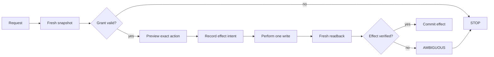

# Attended Browser Bridge

**Browser automation, but with trust issues. Healthy trust issues.**

This repo is a sanitized public slice of the policy core behind my private Browser Bridge work. It is built around one uncomfortable fact: after a browser write, *“I am not sure what happened”* is not permission to try again.

## The loop



No “maybe it clicked, let's click again.” That sentence has caused enough software archaeology already.

## What this proves

- expiring action grants;
- exact origin/action allowlists;
- canonical request fingerprints;
- append-only effect ledger;
- idempotent replay for completed effects;
- **no automatic replay** after an unresolved effect intent;
- deterministic deny reasons.

## Run

```bash
npm test
```

## Example

```js
import { BrowserBridge } from "./src/bridge.js";

const bridge = new BrowserBridge();
const result = bridge.prepare({
  origin: "https://example.test",
  action: "click",
  target: "#save",
  grant: {
    expiresAt: Date.now() + 60_000,
    origins: ["https://example.test"],
    actions: ["click"]
  }
});

console.log(result);
```

## Boundary

This package does not connect to Chrome, sign into websites, bypass CAPTCHAs, send messages, buy things, or control a real browser. It exposes the decision/ledger behavior that real browser control should sit behind.

## Provenance

Rewritten and sanitized from the private `browser-bridge` project, which has a larger attended Chrome/Kaggle transport and stricter local execution boundary.
